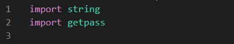
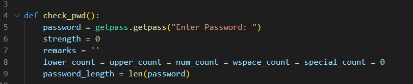
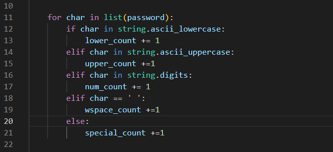
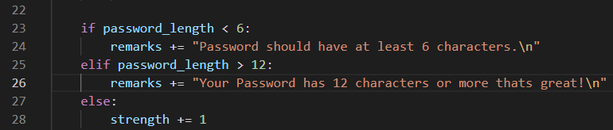
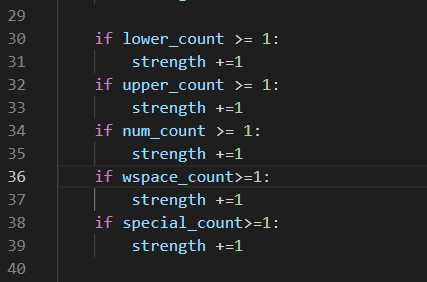
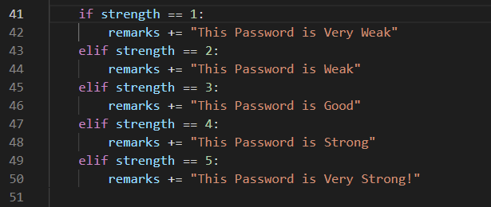
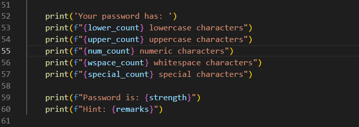
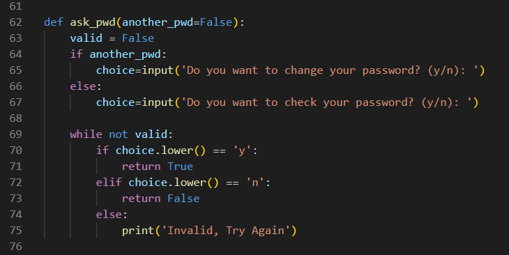
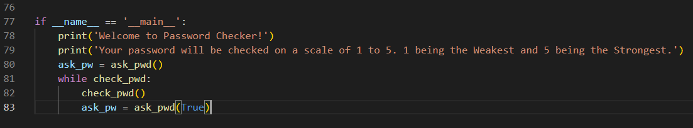

<!DOCTYPE html>
<html lang="en">
<head>
    <meta charset="UTF-8">
    <meta name="viewport" content="width=device-width, initial-scale=1.0">
</head>
<body> 
    

        <h1>Password Checker Explanation</h1>
        
Here's the breakdown of the Python code for the password checker:

        <ol>
            <li><strong>Importing Libraries:</strong>
                <ul>
                    <li><code>string</code>: Contains string constants.</li>
                    <li><code>getpass</code>: Provides secure password input. Password will not be visable while typing it.</li>
                 </ul>
                
           </li>
            <li><strong>Defining Functions:</strong>
                <ul>
                    <li><code>check_pwd()</code>: Function to check password strength.</li>
                <li><code>def check_pwd():</code>: This line defines a function named check_pwd. it will be responsible for checking the strength of a password.
                        </li>
                <li><code>password = getpass.getpass("Enter Password: "):</code> This line prompts the user to enter a password using the getpass.getpass() function. This function is used to securely input passwords,                 as it does not display the characters as they are typed. The entered password is stored in the variable password.
                        </li>
                    <li><code>strength = 0</code>: This line initializes a variable named strength to 0. This variable will be used to represent the strength of the password.
                        </li>
                    <li><code>remarks = ''</code>: This line initializes a variable named remarks to an empty string. This variable will be used to store any remarks or feedback about the password, such as whether it                         meets certain  criteria or not.
                        </li>
                    <li> <code>lower_count = upper_count = num_count = wspace_count = special_count = 0</code>: This line initializes multiple variables (lower_count, upper_count, num_count, wspace_count,                                         special_count) to 0   using a single line. These variables will be used to count the occurrences of different 
                        types of characters (lowercase letters, uppercase letters, digits, whitespace characters, special characters) in the password.
                        </li>
                    <li><code>password_length = len(password):</code>This line calculates the length of the password (number of characters) using the len() function and assigns it to the variable password_length.
                         </li>
                    
            </ul>
            </li> 
            <li><strong>Statements:</strong>      
                <ul>
                    <li><code>for</code>: The for loop iterates over each character in the password.
                    <li><code>char</code>: Is a variable that represents each character in the password string as the loop iterates.</li>
                    <li><code>if,else,elif</code>: Are Statements used to perform different actions based on certain conditions for each character in the password.</li>
                        <li>LINE 12 - <code>if char in string.ascii_lowercase:</code>: Checks if the current character (char) is a lowercase letter.
                            If the condition is true, it increments the lower_count variable by 1, indicating the presence of a lowercase letter in the password.
                        </li>
                            <li>LINE 14 - <code>elif char in string.ascii_uppercase:</code>: Checks if the current character (char) is an uppercase letter. 
                            If the condition is true, it increments the upper_count variable by 1, indicating the presence of an uppercase letter in the password.
                        </li>
                            <li>LINE 16 - <code>elif char in string.digits:</code>: Checks if the current character (char) is a digit (0-9).
                            If the condition is true, it increments the num_count variable by 1, indicating the presence of a numeric character in the password.
                        </li>
                            <li>LINE 18 - <code>elif char == ' ':</code>: hecks if the current character (char) is a whitespace character.
                            If the condition is true, it increments the wspace_count variable by 1, indicating the presence of a whitespace character in the password.
                        </li>
                            <li>LINE 20 - <code>else:</code>: This block is executed if none of the previous conditions are true, meaning the character is neither a lowercase letter, nor an uppercase letter, nor a 
                             digit, nor a whitespace character.
                            In this case, it increments the special_count variable by 1, indicating the presence of a special character (anything that is not a letter, digit, or whitespace) in the password.
                            </li>
                       
                    <li>These next statements are used to check different conditions based on the length of the password (password_length) and provide corresponding remarks.
                    </li>
                        <li>LINE 23<code>if password_length &gt; 6:</code> 
                        Checks if the length of the password is less than 6 characters.
                        If the condition is true, it adds a remark to the remarks variable indicating that the password should have at least 6 characters.
                        </li>
                        <li>LINE 25<code>elif password_length > 12:</code>
                        Checks if the length of the password is greater than 12 characters.
                        If the condition is true, it adds a remark to the remarks variable indicating that the password has 12 characters or more, which is considered great.
                        </li>
                        <li>LINE 27<code>else:</code>
                        This block is executed if none of the previous conditions are true, meaning the length of the password is between 6 and 12 characters (inclusive).
                        In this case, it increments the strength variable by 1, indicating that the password meets the minimum length requirement and is considered to have some strength.
                        </li>    
                        
                        <li>Next if any of these conditions are true, it indicates that the password contains at least one character of that type, 
                        so the strength of the password (strength) is increased by 1.
                        </li>
                        <li>LINE 30<code>if lower_count >= 1:</code>:
                        Checks if the count of lowercase characters (lower_count) is greater than or equal to 1.
                        If true, it increments the strength variable by 1, indicating that the password contains at least one lowercase character.
                        </li>
                        <li>LINE 32<code>if upper_count >= 1:</code>:
                        Checks if the count of uppercase characters (upper_count) is greater than or equal to 1.
                        If true, it increments the strength variable by 1, indicating that the password contains at least one uppercase character.
                        </li>
                        <li>LINE 34<code>if num_count >= 1:</code>:
                        Checks if the count of numeric characters (num_count) is greater than or equal to 1.
                        If true, it increments the strength variable by 1, indicating that the password contains at least one numeric character.
                        </li>
                        <li>LINE 36<code>if wspace_count >= 1:</code>:
                        Checks if the count of whitespace characters (wspace_count) is greater than or equal to 1.
                        If true, it increments the strength variable by 1, indicating that the password contains at least one whitespace character.
                        </li>
                        <li>LINE 38<code>if special_count >= 1:</code>:
                        Checks if the count of special characters (special_count) is greater than or equal to 1.
                        If true, it increments the strength variable by 1, indicating that the password contains at least one special character.
                        </li>
                      
                    <li>These statements are used to provide remarks about the strength of the password based on the value of the strength variable.
                       </li>
                       <li>LINE 41<code>if strength == 1:</code>:
                        Checks if the strength of the password is 1.
                        If true, it adds a remark to the remarks variable indicating that the password is very weak.
                        </li>
                        <li>LINE 43<code>elif strength == 2:</code>:
                        Checks if the strength of the password is 2.
                        If true, it adds a remark to the remarks variable indicating that the password is weak.
                        </li>
                        <li>LINE 45<code>elif strength == 3:</code>:
                        Checks if the strength of the password is 3.
                        If true, it adds a remark to the remarks variable indicating that the password is good.
                        </li>
                        <li>LINE 47<code>elif strength == 4:</code>:
                        Checks if the strength of the password is 4.
                        If true, it adds a remark to the remarks variable indicating that the password is strong.
                        </li>
                        <li>LINE 49<code>elif strength == 5”</code>:
                        Checks if the strength of the password is 5.
                        If true, it adds a remark to the remarks variable indicating that the password is very strong.
                        </li>
                        
                        <li><code>print()</code> Function:
                        The print() function is used to display messages or output to the console.
                        </li>
                        <li>Overall, these print() statements provide detailed information about the composition of the password, including the counts of lowercase,
                            uppercase, numeric, whitespace, and special characters. This feedback helps the user understand the characteristics of their password.
                        </li> 
                       
                        <li>LINE 62 - Function Definition:<code>def ask_pwd(another_pwd=False):</code>: Function to ask user if they want to check or change their password.
                        </li>
                        <li>LINE 63 - Variable Initialization:<code>valid = False</code>: Initializes a variable valid to False. This variable is used to control the validation loop.
                        </li>
                        <li>LINE 64 - Input Prompt:<code>if another_pwd:</code>: Checks if the another_pwd parameter is True. If it is, it means the function is being used to ask if the user wants to change their 
                         password. <code>choice = input</code>('Do you want to change your password? (y/n): '): Prompts the user to input a choice ('y' for yes, 'n' for no) about changing their password.
                        </li>
                        <li>LINE 69 -  Conditional Loop:<code>while not valid:</code> This creates a loop that continues until the valid variable becomes True. This loop is used to ensure that the user enters a valid 
                         choice ('y' or 'n').
                        </li>
                        <li>User Input Validation:</li>
                        <li>LINE 70 <code>if choice.lower() == 'y':</code>: Checks if the user's input (converted to lowercase) is 'y' (indicating yes). If true, it returns True, indicating that the user wants to 
                        proceed.
                        </li>
                        <li>LINE 72<code>elif choice.lower() == 'n':</code>: Checks if the user's input (converted to lowercase) is 'n' (indicating no).
                        If true, it returns False, indicating that the user does not want to proceed.
                        </li>
                        <li> LINE 74<code>else:</code>: If the user input is neither 'y' nor 'n', it means the input is invalid.
                        <li>Prints a message indicating that the input is invalid and prompts the user to try again.
                        Overall, this function prompts the user to choose whether they want to check their password or change it. It ensures that the user provides a valid input ('y' or 'n') and returns True if the 
                        user wants to proceed and False if they do not.
                       
                        </li>
                    </ul>
            </li>
            <li><strong>Main Execution:</strong>
                <ul>
                    <li><code>if __name__ == '__main__':</code>: Executes code if script is run directly.</li>
                    <li><code>print('Welcome to Password Checker!')</code>: Displays welcome message.</li>
                    <li><code>print('Your password will be checked on a scale of 1 to 5...')</code>: Provides information about password strength scale.</li>
                    <li>Loop to repeatedly check passwords:
                        <ul>
                            <li><code>check_pwd()</code>: Calls function to check password.</li>
                            <li><code>ask_pw = ask_pwd(True)</code>: Calls function to ask if user wants to change password.</li>
                        
                        </ul>
                   </li>
                </ul>
            </li>
           </h1 Executing the code</h1>
        </ol>
        

    

</body>
</html>
