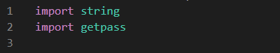

# Pwd-Strength-Check
A password strength checker written in Python. It grades a password from 1 to 5 based on the length of the password, lowercase, uppercase, numbers, whitespace, and special characters.

